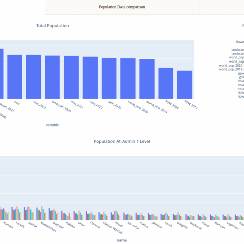

# FDW - Afghanistan Population
This project is designed to compare and analyze population data for Afghanistan from various sources. The goal is to provide a comprehensive overview of the country's demographics, identify disparities and inconsistencies in the data, and gain insights into the factors that contribute to these differences.

## Summary

|  |  |
|---|---|
| DSAA Team Lead | Ahmad Mohassel | 
| Project Tier | 1 | 
| DSAA Team Members | - Ahmad Mohassel - Peter Mburu |
| Client(s) | Famine Early Warning Systems Network (FEWS NET) |
| Internal Client(s) | Famine Early Warning Systems Network (FEWS NET) |
| Project Start Date | 12/12/2022 |
| Project End Date | 01/31/2023 |
| Status | Waiting for feedback|                                                                 

## Raw Materials In
The repository uses data from government agencies and international organizations. All datasets are cleaned and processed stored in CKAN.
The datasets include:
* The GHS population dataset downloaded from [here](https://ghsl.jrc.ec.europa.eu/download.php?ds=pop)
* The WorldPop population dataset downloaded from [here](https://hub.worldpop.org/geodata/listing?id=29)
* The landscan population data is available [here](https://landscan.ornl.gov/)
* The GPW v4 is available [here](https://sedac.ciesin.columbia.edu/data/set/gpw-v4-population-density-adjusted-to-2015-unwpp-country-totals-rev11/data-download)
* The NSIA population data is extracted from here [pdf](http://nsia.gov.af:8080/wp-content/uploads/2022/05/%D8%A8%D8%B1%D8%A2%D9%88%D8%B1%D8%AF-%D9%86%D9%81%D9%88%D8%B3-%D8%B3%D8%A7%D9%84-1401_compressed.pdf)
* FlowMinder population data is extratced from this [pdf](https://www.ipcinfo.org/fileadmin/user_upload/ipcinfo/docs/IPC_Afghanistan_AcuteFoodInsec_2022Mar_2022Nov_report.pdf).

## Result Out

## Usage/Examples

Run the jupyter notebook and open the URL at the end.
## FAQ

#### Q: Does it work well on Linux, Windows and Mac?
A: Linux confirmed not sure about Windows and Mac

## Support
For support, email pmburu@air.com for a response that is sure to be real

## License
MIT
### Roadmap

- Test the project on Mac